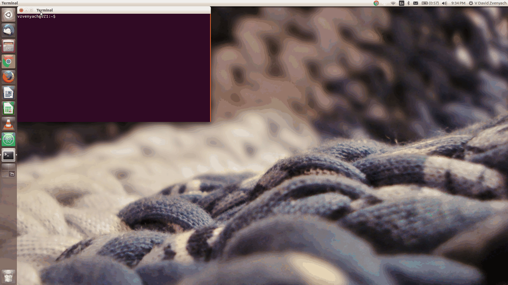

# isitchristmas-electron

When you need to have [isitchristmas.com](https://isitchristmas.com) on your desktop.

## Installation

`npm install -g isitchristmas-electron`

## Usage:

`xmas?`

## License

CC0-1.0
